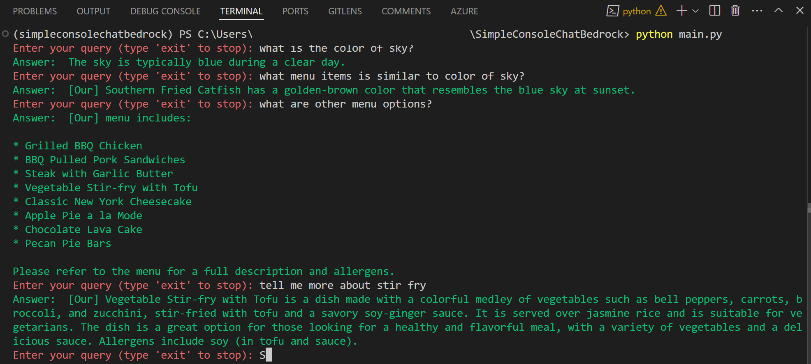

# SimpleConsoleChatBedrock

## Project Overview
This project includes two primary components: `ChatAssistantBedrock` and `ChatAssistantLangChain`, which interface with AWS Bedrock services. These modules are designed to process and respond to user queries by leveraging AWS's powerful large language models and knowledge bases.

## Features
- **ChatAssistantBedrock**: Makes use of AWS Bedrock LLM and knowledge base services to handle and respond to user queries.
- **ChatAssistantLangChain**: Incorporates LangChain with AWS functionalities to enhance query processing and response generation through a sophisticated retrieval-augmented generation chain.

## Prerequisites
- Python 3.x
- boto3
- An active AWS account with configured credentials
- Optional: Virtual environment setup

## Installation

### 1. Clone the repository:
```bash
   git clone <repository-url>
   cd <project-directory>
```

### 2. Set up a virtual environment (Optional):
```bash
    python -m venv venv
    source venv/bin/activate  # On Windows use `venv\Scripts\activate`
```

### 3. Install dependencies:
```bash
    pip install -r requirements.txt
```

## Configuration
Ensure AWS credentials are properly configured, either through the AWS CLI or by setting environment variables (AWS_ACCESS_KEY_ID, AWS_SECRET_ACCESS_KEY, and AWS_SESSION_TOKEN).

Edit main.py file and update the knowledgebase id to one of your knowledgebases.

## Running the Application
Start the application by executing the main.py
```bash
    python main.py
```
## Usage
After launching the application, enter queries when prompted. Responses will be generated based on the input. Type 'exit' to terminate the application.


## Contributions
Contributions to this project are welcome! Please fork the repository and submit pull requests with any enhancements or fixes.

## License
This project is licensed under MIT, see the LICENSE file for details.
